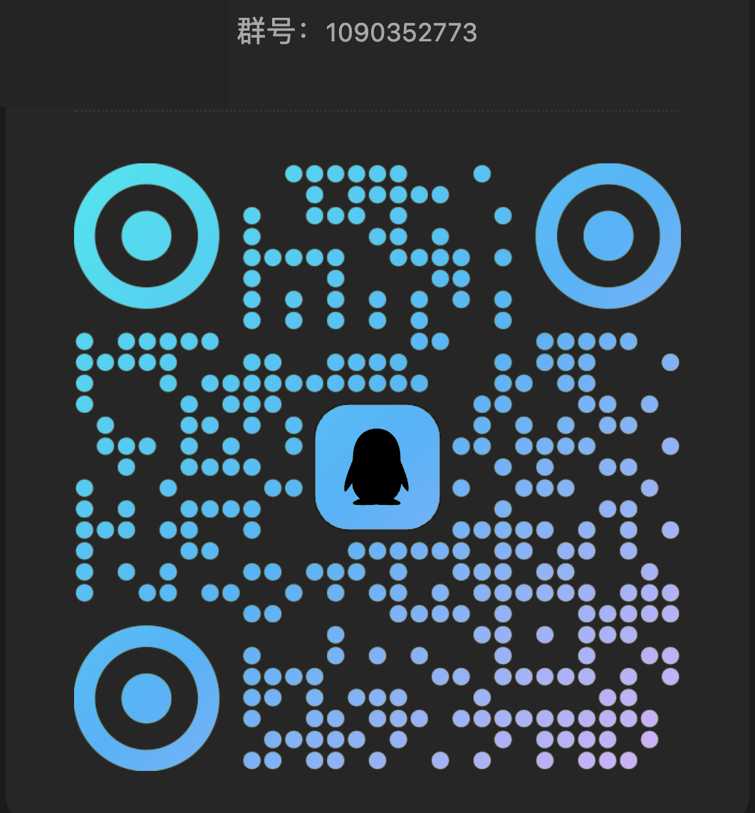

# Mocika Shield — Android APK Hardening Tool

[简体中文](README.md) | English

[](https://github.com/mocikadev/mocika-shield/releases/latest)
[](https://github.com/mocikadev/mocika-shield/actions/workflows/ci.yml)
[](#license)

Protect and sign Android APKs and manage certificates locally. DEX encryption, certificate binding, and baseline runtime protection raise the cost of static analysis, tampering, and unauthorized re-signing—not a guarantee against unpacking or reverse engineering.

The recommended desktop GUI supports Windows, macOS, Linux, and Chinese/English interfaces. A source-built CLI is available for automation and development.

> Use only with applications you own or are authorized to protect. Do not bypass third-party protections or use this tool for unauthorized purposes.

## Core Capabilities

- **DEX and runtime protection:** encrypt application DEX files, bind them to the original certificate, and apply baseline anti-debugging or optional strict environment checks.
- **Preflight checks:** inspect signatures, existing protection, system requirements, and ABIs, with compatibility warnings and supported actions.
- **Integrated signing:** import, create, and manage certificates; automatically sign protected output or sign an APK independently.
- **Reusable settings:** remember protection options and the protection page's certificate choice, customize output directory and filename, and freeze each running task's configuration.
- **Installation compatibility:** handle APK ZIP alignment and common native-library cases, with separate standard and Android 4.4 industrial modes.
- **Diagnostics:** copy sanitized summaries and optionally preview and submit an error report. APKs and signing materials are processed locally.

## Download and Quick Start

Download a stable desktop installer from [GitHub Releases](https://github.com/mocikadev/mocika-shield/releases/latest).

| Platform | Package |
|---|---|
| Windows | `MocikaShield_x.y.z_windows_x64_setup.exe` |
| macOS | `MocikaShield_x.y.z_macos_universal.dmg` |
| Linux | `MocikaShield_x.y.z_linux_amd64.AppImage` or `.deb` |

Install a **full JDK 8 or later**, with `java` and `keytool` available. Desktop release users do not need to install the Android SDK. Installers are not commercially code-signed or notarized; download only from a trusted source.

1. In **Certificates**, import the original APK's signing certificate. For a new project, you may create one, but the input APK must also be signed with it first.
2. In **Protect**, select an already signed APK and review the preflight results.
3. Choose the target system and protection policy. Normally use Android 5.0+ and the recommended standard protection; use industrial mode only when Android 4.4 is required.
4. Review the output directory, filename, automatic signing certificate, and per-app sharing choice, then start protection.
5. Test the signed output on target devices: installation, launch, core functionality, and upgrade installation.

Output defaults to the input APK's directory with a suggested filename; both can be changed before execution. Without automatic signing, sign the output with the original certificate. **Re-signing protected output with another certificate prevents startup.**

<details>
<summary>macOS reports that the developer cannot be verified</summary>

After verifying the download source and moving the application to `/Applications`, you can run:

```bash
xattr -rd com.apple.quarantine /Applications/MocikaShield.app
```

This removes quarantine; it does not mean the application is notarized by Apple. Open it again. See the [usage guide](docs/usage.md) for more help.

</details>

## Preview


The screenshot illustrates the layout; available options depend on the current version. More screens and instructions are in the [usage guide](docs/usage.md).

## Compatibility and Limitations

| Mode | Scope |
|---|---|
| Android 5.0 and later | API 21+; `armeabi-v7a`, `arm64-v8a`, `x86`, and `x86_64`. An APK does not need all four ABIs |
| Android 4.4 industrial | API 19+; inputs must have no native libraries or only `armeabi-v7a` libraries. Physical-device coverage is an Android 4.4.2 `armeabi-v7a`/NEON industrial device |

- Compatibility mode does not lower the application's `minSdkVersion`; vendor systems and hardware still need testing.
- APK only: no direct AAB or APKS protection, no re-protecting protected APKs, and inputs must be signed.
- The GUI processes one APK at a time; no batch queue is provided.
- Unneeded legacy ABIs can be excluded with per-task confirmation. Prefer filtering them in the original project; missing business libraries are not generated.
- 16 KB ZIP alignment does not establish ELF page-size compatibility for every third-party library or guarantee Google Play acceptance.
- A blank AppImage window on some Fedora environments remains under investigation: [#121](https://github.com/mocikadev/mocika-shield/issues/121).

See the [usage guide](docs/usage.md) for detailed boundaries. Include the version, environment, and sanitized diagnostics when reporting problems.

## How It Works and Security Scope

Protection reads the original certificate, compresses and encrypts DEX files, injects the stub, then rebuilds, aligns, and optionally signs the APK. At runtime, the stub checks the environment, validates or decrypts the DEX cache, loads code, and starts the original application.

Production uses a decrypted DEX cache in the application's private directory. It is **not a fully in-memory DEX loader or method-code extraction scheme**. Root access, process control, or other elevated privileges may allow runtime code extraction. Standard protection does not block startup solely because of root signals; strict protection blocks some risky environments but cannot guarantee detection of hidden root or prevent bypasses.

Hardening does not replace server-side authorization, key management, or application security design. See [runtime security](docs/design/runtime-security.md) and [technical internals](docs/design/internals.md).

## Privacy

APKs, certificates, keystores, and signing passwords are processed locally and not uploaded. The desktop tool has three independent data channels:

| Channel | Data and controls |
|---|---|
| Anonymous usage statistics | Enabled by default; random installation identifier, tool version, launch/task counts, and fixed failure categories. Can be disabled in Settings; no package names or raw logs |
| Safe error reports | Preview and confirm each report; no raw logs, APKs, paths, package names, certificates, or passwords. Independent of the statistics switch |
| Per-app usage sharing | Controlled on protection/signing pages, selected by default for new package names. Opt-outs persist across pages and restarts. Successful operations send app name, package name, version code, tool version, operation, flow, success date, and protocol/deduplication metadata; no device identifier |

App sharing is independent of anonymous statistics. Reports are maintainer-only and retained for 180 days. Opting out stops future sharing for that package but does not delete received records. **These reporting features are not injected into protected APKs.** See [data and privacy documentation](docs/ops/telemetry.md) for scope, retention, and deletion details.

## Documentation and Development

| Topic | Documentation |
|---|---|
| GUI, certificates, configuration locations, and CLI | [Usage guide](docs/usage.md) |
| Installation and runtime problems | [Troubleshooting](docs/ops/troubleshooting.md) |
| Source builds | [Build guide](docs/ops/build.md), [environment requirements](docs/ops/environment.md) |
| Architecture and internals | [Documentation index](docs/README.md) |
| Future work | [Roadmap](docs/process/roadmap.md) |

Detailed guides are currently primarily in Chinese. The CLI is source-built; Releases contain desktop GUI packages only. Build `make build-stub` first, then `make build-cli` or `make build-gui`. Refer to the build guide for dependencies and platform-specific steps.

## Feedback and Community

- Read the [support guide](docs/process/support.md), then open a [GitHub issue](https://github.com/mocikadev/mocika-shield/issues). Copy diagnostics from **About**.
- Use the [feature request form](https://github.com/mocikadev/mocika-shield/issues/new?template=feature_request.yml), or upvote an existing matching request.
- Report vulnerabilities privately following [SECURITY.md](SECURITY.md). Do not publish exploits, business APKs, certificates, or passwords.
- Chinese-language QQ community: `1090352773`. Keep actionable bug reports in GitHub issues for tracking.

<details>
<summary>QQ group QR code</summary>



</details>

## License

Dual-licensed under **MIT OR Apache-2.0**, at your choice: [MIT](LICENSE-MIT) · [Apache-2.0](LICENSE-APACHE).
