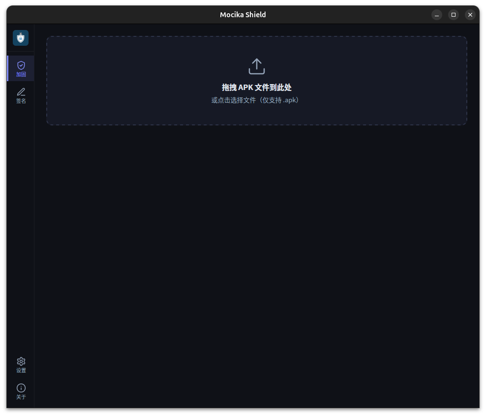
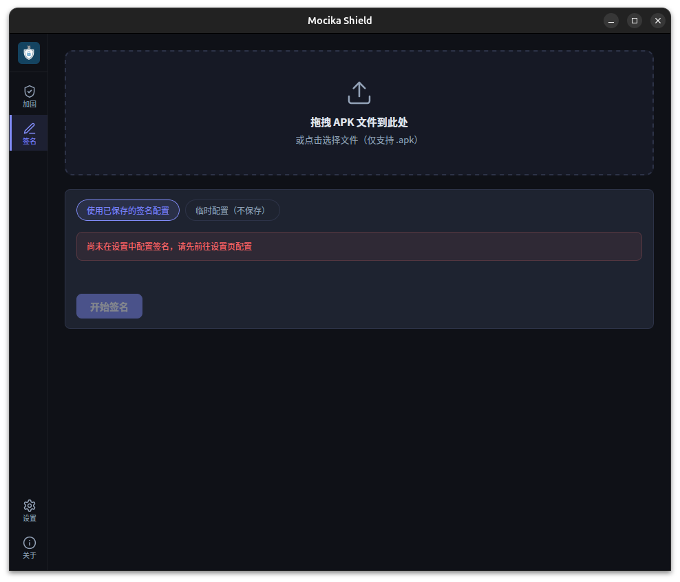
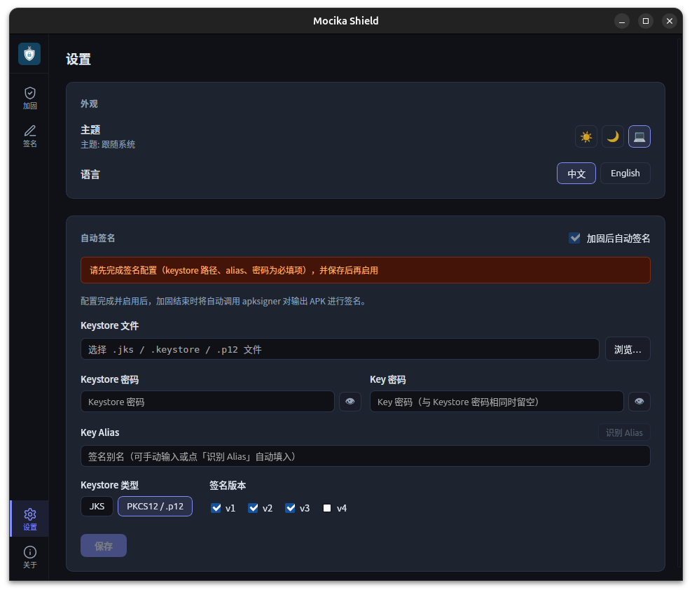
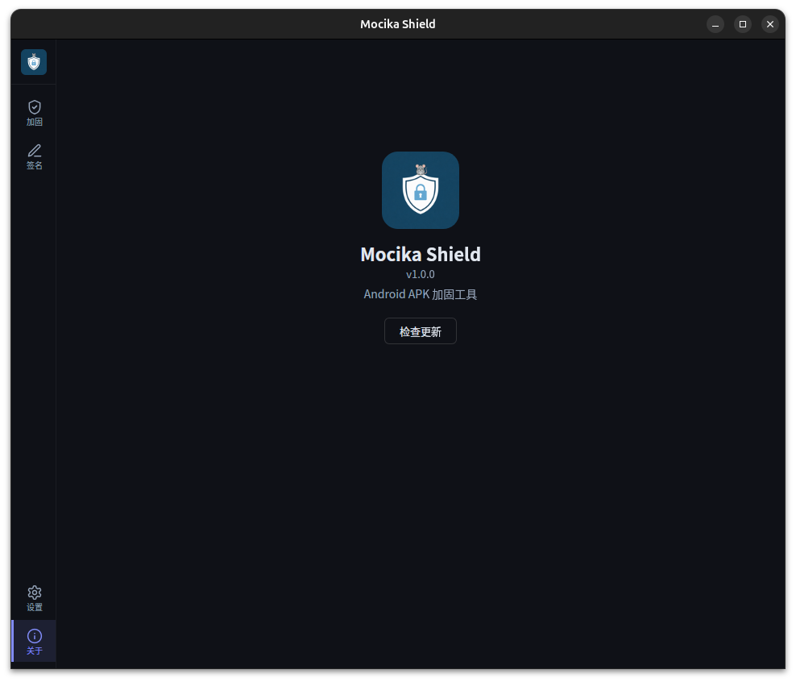

# Mocika Shield

Android APK 离线加固工具，桌面 GUI，三平台支持。

---

## 功能特性

- **DEX 加密保护**：Zstd 压缩 + ChaCha20-Poly1305 认证加密，密钥通过 HKDF-SHA256 派生，签名指纹绑定密钥派生，防逆向重用
- **防重打包**：证书指纹嵌入加密 payload，重打包后应用无法正常启动
- **运行时反调试**：Rust native 层检测 ptrace 附加、Frida maps 特征，检测到立即中止
- **低特征**：加密数据追加到 `classes.dex` 末尾，apktool / jadx 完全不可见；壳类名、JNI 符号均经过混淆
- **多架构支持**：arm64-v8a / armeabi-v7a / x86 / x86_64
- **完全离线**：加固过程在本地完成，不上传任何文件
- **内置签名工具**：支持拖拽 APK + 密钥库，加固后可自动签名
- **版本更新提示**：有新版本时自动提示（patch/minor 横幅、major 弹窗）
- **中英双语界面**：跟随系统语言，可在设置页手动切换

---

## 下载

前往 [Releases](../../releases) 页面下载对应平台的安装包。

| 平台 | 安装包 | 说明 |
|------|--------|------|
| Linux | `.AppImage` | 单文件免安装，点击即用 |
| Linux | `.deb` | Debian / Ubuntu 安装包 |
| macOS | `_arm64.dmg` | Apple Silicon（M 系列芯片） |
| macOS | `_universal.dmg` | Intel + Apple Silicon 通用 |
| Windows | `_setup.exe` | NSIS 安装程序 |

---

## 使用说明

安装后直接打开，界面包含四个页面：

**加固**

1. 拖入或选择一个**已签名的** APK
2. 点击「加固」，等待完成
3. 自动生成加固后的 APK（未签名），失败时错误信息支持一键复制
4. 切换到签名页对产物重新签名，完成后即可安装

> ⚠️ **加固前的 APK 必须已签名。** 未签名的 APK 无法进行加固。

**签名**

拖入 APK + 配置密钥库 → 点击「签名」即可。

> 在设置页配置好密钥库后，可开启「加固后自动签名」，加固与签名一步完成。

**设置**

切换深色 / 浅色主题、切换界面语言（中文 / 英文）。

**关于**

显示当前版本号、构建 git hash、构建日期及工具链版本。

---

## 截图

| 加固 | 签名 |
|------|------|
|  |  |

| 设置 | 关于 |
|------|------|
|  |  |

---

## 系统要求

使用前请确保已安装 **Java 8 或以上版本**。
