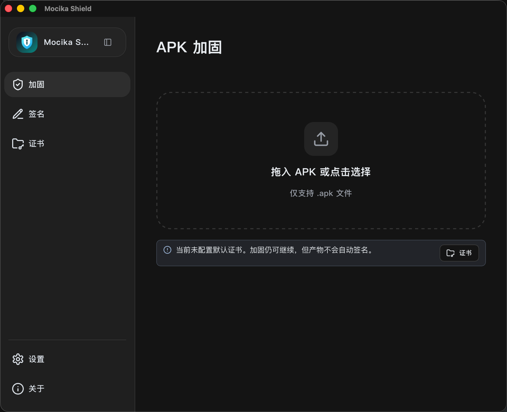
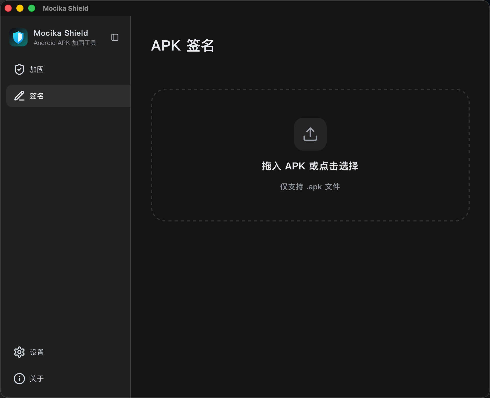
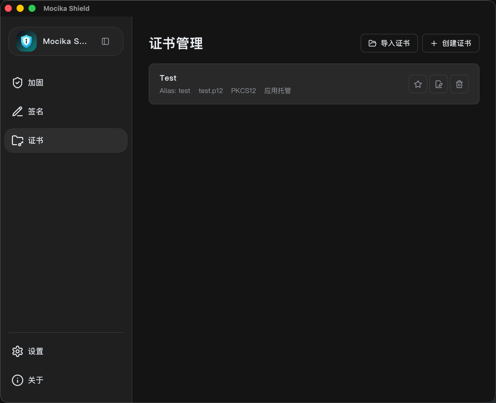
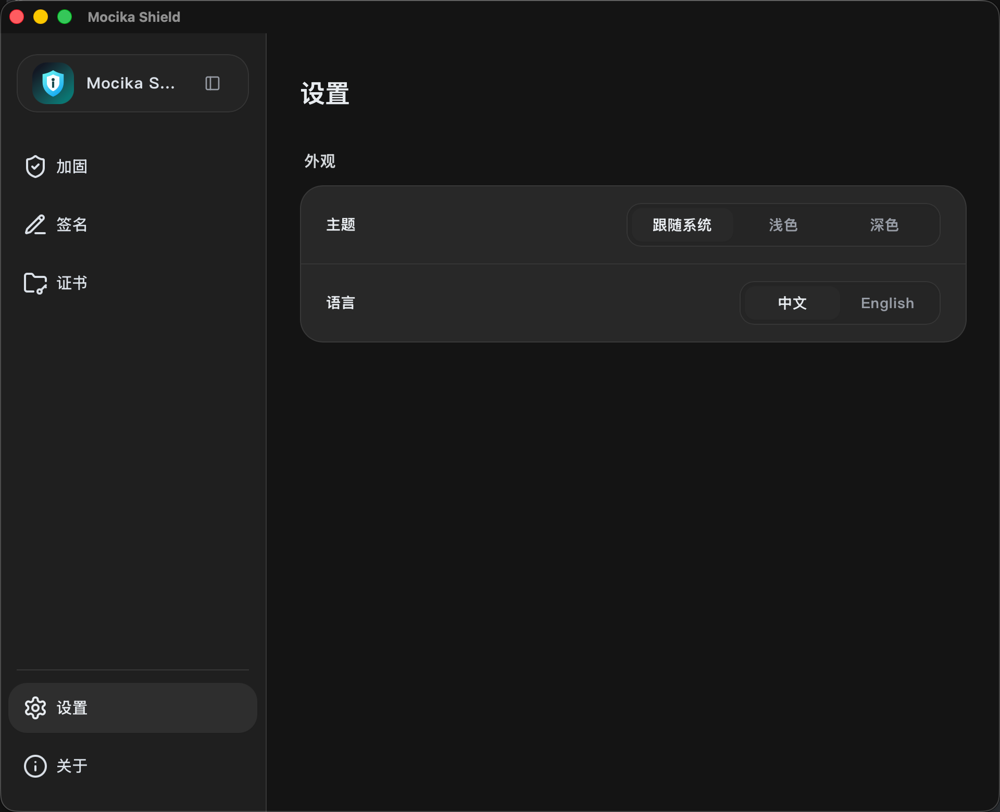
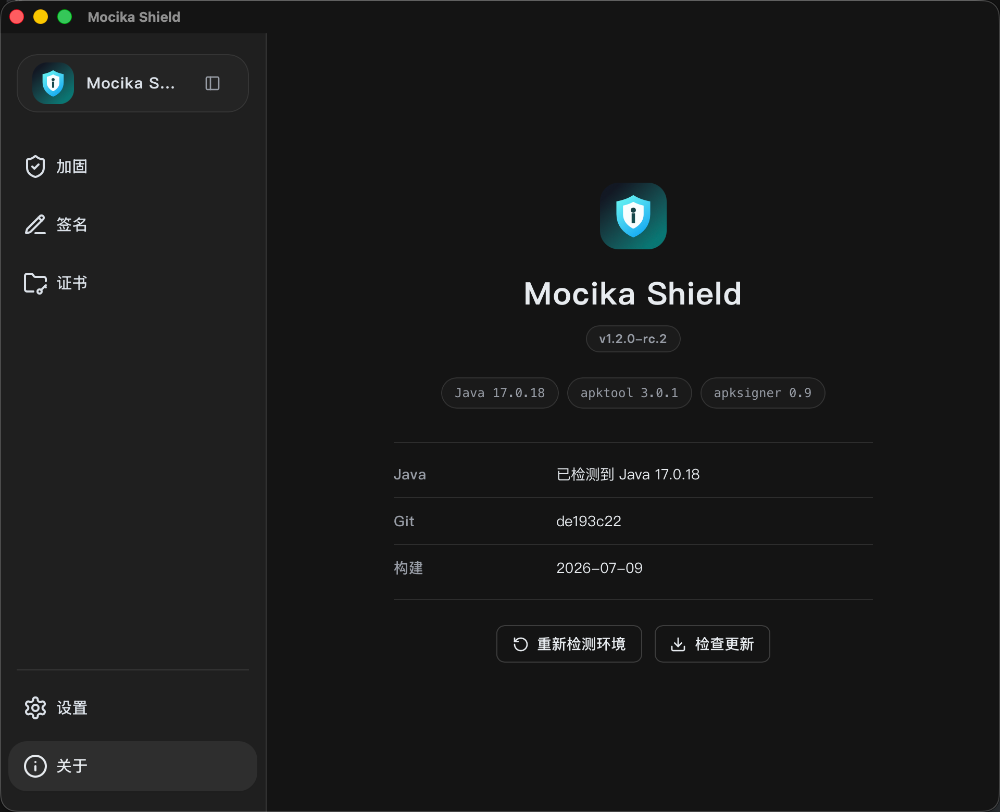

# Mocika Shield — Android APK 加固工具

[](https://github.com/mocikadev/mocika-shield/releases/latest)
[](https://github.com/mocikadev/mocika-shield/actions/workflows/ci.yml)
[](LICENSE)

对 Android APK 的 DEX 文件进行压缩加密，并在运行时通过壳程序动态解密加载，防止静态反编译与重打包攻击。

提供两种使用方式：**桌面 GUI**（推荐）和 **命令行**。当前 Rust 部分已整理为统一 workspace：`shield-core` 提供共享核心能力，`apps/shield-cli` 与 `apps/shield-gui` 分别作为命令行与桌面入口。

> 本项目仅用于保护你拥有合法权利的 Android 应用。请勿用于绕过第三方应用保护、规避平台安全机制或其他未授权场景。

## 项目关注趋势

[](https://mocikadev.github.io/mocika-shield/)

> 当前星标、复刻、未关闭事项与累计下载接近实时更新，历史趋势每日更新。下载次数不等于独立用户数；应用使用数据仅包含用户允许上报的匿名每日汇总。[查看统计口径](docs/ops/project-statistics.md)

---

## 功能特性

- **DEX 加密保护**：Zstd 压缩 + ChaCha20-Poly1305 认证加密（AEAD），密钥通过 HKDF-SHA256 派生，签名指纹绑定密钥派生，防逆向重用
- **签名校验**：证书指纹写入 DEXB v5 头部并参与密钥派生，运行时 timing-safe 比对，重打包后解密必然失败
- **运行时反调试**：Rust native 层检测 ptrace 附加（TracerPid）、Frida maps 特征、Frida GLib 线程名，检测到立即中止
- **低特征**：加密数据追加到 `classes.dex` 末尾（DEX `file_size` 边界外），apktool / jadx 完全不可见，无 `assets/app.bin`；壳类名、JNI 符号、日志字符串均经过混淆，静态分析难以定位入口
- **GUI 签名工具**：内置 APK 签名标签页，支持拖拽、自动清理 `.idsig`，无需额外工具
- **内置 APK 对齐**：加固输出与 GUI 签名链路会自动执行 4 KB / 16 KB ZIP 对齐，无需额外运行 `zipalign`
- **完全离线**：加固、签名和校验均在本地完成，不上传 APK 或密钥库
- **版本更新提示**：启动时自动检查 GitHub Releases，有新版本时分级提示（patch/minor 横幅、major 弹窗）
- **多架构支持**：arm64-v8a / armeabi-v7a / x86 / x86_64
- **中英双语界面**：GUI 跟随系统语言，可手动切换

---

## 快速开始

### 方式一：桌面 GUI（推荐）

从 [Releases](https://github.com/mocikadev/mocika-shield/releases/latest) 下载对应平台的安装包：

| 平台 | 安装包 | 实现 |
|------|--------|------|
| Linux | `MocikaShield_x.y.z_linux_amd64.AppImage` / `.deb` | Tauri v2 |
| macOS | `MocikaShield_x.y.z_macos_universal.dmg` | Tauri v2 |
| Windows | `MocikaShield_x.y.z_windows_x64_setup.exe` | Tauri v2 |

> 桌面 GUI 基于 Tauri v2 + React + TypeScript 构建，Linux / macOS / Windows 共用同一套界面与配置。

> **macOS 首次打开（未签名版本）**
>
> macOS 会提示「无法验证开发者」，在终端执行以下命令去除隔离标记，执行后正常双击打开即可，只需操作一次：
> ```bash
> xattr -rd com.apple.quarantine /Applications/MocikaShield.app
> ```

界面包含五个页面：
- **加固**：拖入或选择 APK → 预检验证（非 APK 文件立即提示）→ 点击加固 → 实时进度 → 自动生成 `{name}_protected.apk`；加固失败时错误信息支持一键复制
- **签名**：拖入或选择 APK → 选择证书页维护的证书 → 点击签名 → 生成 `{name}_signed.apk`；签名成功后只保留“继续签名”入口
- **证书**：统一管理签名证书，支持导入、新建、校验、设为默认、删除；创建证书时 Keystore 密码至少 6 位，Key 密码可留空
- **设置**：切换深色 / 浅色主题、切换界面语言（中文 / 英文）
- **关于**：显示当前版本号、构建 git hash、构建日期、Java 环境状态，支持手动重新检测环境和复制诊断信息

界面预览：



更多界面：

| 签名页 | 证书页 |
|--------|--------|
|  |  |

| 设置页 | 关于页 |
|--------|--------|
|  |  |

### 支持矩阵

| 能力 | Linux | macOS | Windows |
|------|-------|-------|---------|
| GUI 使用发布包 | 支持 | 支持 | 支持 |
| CLI 本地构建/维护者包 | 支持 | 支持 | 支持 |
| 从源码编译 GUI | 支持 | 支持 | 支持 |
| Android 壳构建 | 支持 | 支持 | 支持 |

### 首次使用最短路径

1. 从 [Releases](https://github.com/mocikadev/mocika-shield/releases/latest) 下载对应平台的 GUI 安装包并安装
2. 在 **证书** 页面导入已有证书，或创建新的 PKCS12 证书
3. 将常用证书设为默认；加固页会在自动签名时使用默认证书
4. 回到 **加固** 页面选择已签名 APK，按需使用自动签名
5. 产物默认输出到原 APK 同目录，文件名为 `{name}_protected.apk` 或 `{name}_protected_signed.apk`

### 签名材料准备

在开始前，请准备：

- 已签名的原始 APK
- 与该应用同一证书链对应的 `keystore` / `p12`
- `alias`
- `keystore` 密码
- `key` 密码（与 `keystore` 密码相同可留空）

使用 PKCS12 证书时，`keytool` 可能会把输入的 Alias 规范为小写。GUI 会按大小写不敏感方式校验，并保存 keystore 中实际返回的 Alias。

如果原 APK 与默认自动签名证书的指纹不一致，GUI 会在预检阶段阻止加固。加固数据与原证书绑定，改用其他证书签名会导致应用无法启动。

### 配置与证书数据

GUI 启动时一次性加载应用级配置与证书数据库，运行期间使用全局内存状态，不会在页面切换时反复从磁盘读取。应用级配置保存到 `config.toml`；证书列表、默认证书、签名密码、校验状态保存到本地 SQLite 数据库 `shield.db`。密码字段会以本机派生密钥加密保存；证书列表返回前端时不包含密码明文，签名和自动签名只传证书 ID，由后端读取并解密。应用内新建或托管的 keystore 文件放在同级 `keystores/` 目录。
Java 运行环境同样会在应用启动时检测一次，并缓存到全局状态中；关于页提供“重新检测环境”入口，用于用户安装或切换 JDK 后手动刷新。

| 平台 | 应用配置 | 证书数据库 |
|------|----------|------------|
| Linux | `~/.config/dev.mocika.shield-gui/config.toml` | `~/.local/share/dev.mocika.shield-gui/shield.db` |
| macOS | `~/Library/Application Support/dev.mocika.shield-gui/config.toml` | `~/Library/Application Support/dev.mocika.shield-gui/shield.db` |
| Windows | `%APPDATA%\\dev.mocika.shield-gui\\config.toml` | `%APPDATA%\\dev.mocika.shield-gui\\shield.db` |

### 方式二：命令行（CLI）

当前 GitHub Release 面向普通用户只提供桌面 GUI 安装包。CLI 仍保留给脚本化、本地调试和维护者使用，可从源码编译，或由维护者使用本地发布脚本生成离线包。

```bash
# 从源码编译
make build-stub
make build-cli

# 加固
./target/release/shield protect -i input.apk -o protected.apk

# 签名（加固后必须重新签名；无需额外执行 zipalign）
java -jar lib/apksigner.jar sign --ks keystore.jks protected.apk

# 安装
adb install -r protected.apk
```

命令行参数：

```
用法：shield protect [OPTIONS] --input <APK> --output <APK>

  -i, --input <APK>   输入 APK 路径
  -o, --output <APK>  输出 APK 路径
      --json-progress 输出 JSON 进度事件
  -v, --verbose       输出详细日志
  -h, --help          显示帮助
  -V, --version       显示版本
```

---

## 工作原理

### 加固流程（CLI）

```
原始 APK
    ↓
[1. 解包] → apktool 解包（不反编译 Smali）
    ↓
[2. 修改 Manifest] → Application 替换为 StubApp，注入 ORIGINAL_APPLICATION meta-data
    ↓
[3. 提取签名] → `apksigner` 验证并读取原始 APK 当前内容签名证书的 SHA-256 指纹
    ↓
[4. 打包加密 DEX] → Zstd 压缩 → ChaCha20-Poly1305 加密 → DEXB v5（含签名指纹与随机 IKM）→ 追加到 classes.dex 末尾
    ↓
[5. 注入壳资源] → stub-classes.dex + libmocikashield.so（四架构）
    ↓
[6. 重新打包并对齐] → 生成 4 KB / 16 KB 对齐的加固 APK（未签名，需手动签名）
```

### 运行时流程（Android 设备）

```
应用启动
    ↓
[1. StubApp.attachBaseContext] → 壳 Application 启动
    ↓
[2. 反调试检测] → Rust native 层检测 ptrace / Frida，命中立即抛异常中止
    ↓
[3. 读取 classes.dex] → 扫描末尾 MSHD magic，提取加密 payload
    ↓
[4. JNI → Rust] → HKDF 派生密钥 → ChaCha20-Poly1305 解密 → Zstd 解压
    ↓
[5. 签名校验] → 读取设备实际签名参与密钥派生，并与 payload 头部指纹 timing-safe 比对，不匹配则 SecurityException
    ↓
[6. DEX 注入] → native 层注入 PathClassLoader，app 类优先
    ↓
[7. 启动真实 Application] → 原始应用正常运行
```

---

## 安全特性

| 特性 | 说明 |
|------|------|
| AEAD 加密 | ChaCha20-Poly1305，密文篡改立即检测，不返回明文 |
| 每次加固随机 nonce | HKDF-SHA256(ikm, nonce) 派生密钥，相同 APK 每次加固产生不同密文 |
| 签名指纹绑定密钥派生 | IKM 随机生成并与证书指纹联合派生，逆向 CLI/stub 无法重建其他 APK 的解密密钥 |
| 签名指纹绑定加密密钥 | 指纹写入 DEXB v5 头部并参与 HKDF info，重签后派生密钥不同，AEAD 解密失败 |
| Timing-safe 签名比对 | 常数时间比对，防时序攻击 |
| 低特征 | 无 `assets/app.bin`，加密数据对静态工具不可见；壳类名、JNI 符号经混淆处理 |
| 运行时反调试 | Rust native 层检测 ptrace、Frida maps 特征与 Frida GLib 线程名，检测到立即中止 |

---

## 项目结构

```
mocika-shield/
├── crates/
│   └── shield-core/         # Rust 共享核心库（加固、签名、ZIP 对齐、Java/工具探测）
├── apps/
│   ├── shield-cli/          # Rust 命令行工具（单一二进制 shield）
│   └── shield-gui/          # 桌面 GUI（Tauri v2，Linux/macOS/Windows）
│       ├── src-tauri/       # Tauri 后端（直接链接 shield-core）
│       └── src/             # React + TypeScript 前端
├── shield-stub/             # Android 壳模块
│   └── src/main/
│       ├── java/            # Java 壳层（StubApp、Ld）
│       └── rust/            # Rust Native 层（libmocikashield.so，含反调试）
├── tools/                   # 外部工具（apktool、apksigner）
├── scripts/                 # 构建与发布脚本
└── Makefile                 # 统一构建入口
```

---

## 从源码编译

```bash
# 1. 构建 Android 壳模块（必须先执行）
make build-stub

# 2. 编译 CLI
make build-cli

# 3. 编译 Tauri GUI（需先 build-stub）
make build-gui

# 一键全部构建
make build-all
```

详见 [docs/ops/build.md](docs/ops/build.md)。

---

## 环境要求

| 场景 | 要求 |
|------|------|
| 使用 CLI（源码构建或维护者本地包） | Java 17+（需完整 JDK，`java` / `keytool` / `javac` 可用） |
| 使用发布包（GUI） | Linux / macOS / Windows，Java 17+（加固、签名、Alias 识别需要完整 JDK） |
| 从源码编译 | Rust 1.70+，Node.js 22+，Java 17+，Android SDK (API 21+)，Android NDK 29.0.14206865，cargo-ndk，tauri-cli |

## 当前限制

- 输入 APK 必须已经签名；未签名 APK 会在预检阶段被拒绝
- 不支持对已加固 APK 再次加固
- GUI 当前以单 APK 工作流为主，不支持批量队列
- Windows 端当前主要提供 GUI 发布产物；CLI 使用建议从源码编译
- 加固依赖本地 `apktool` / `apksigner` / `resources.zip`，从源码编译前必须先执行 `make build-stub`

---

## 许可证

[MIT](LICENSE)

## 安全问题

请阅读 [SECURITY.md](SECURITY.md)。不要在公开 issue 中披露可直接复现的攻击细节。

## 问题反馈

提交 issue 前建议阅读 [支持与问题反馈](docs/process/support.md)，本地排障可参考 [本地诊断与排障命令](docs/ops/troubleshooting.md)。反馈时请在关于页复制诊断信息，不要在公开 issue 中上传 APK、keystore、证书密码或签名密码。

如果希望增加新能力或改进工作流，请使用[功能建议表单](https://github.com/mocikadev/mocika-shield/issues/new?template=feature_request.yml)。提交前先搜索已有建议；对于相同需求，请在原 issue 使用 👍 表示支持。需求统计与评审规则见[功能需求收集与评审](docs/process/feature-requests.md)。
